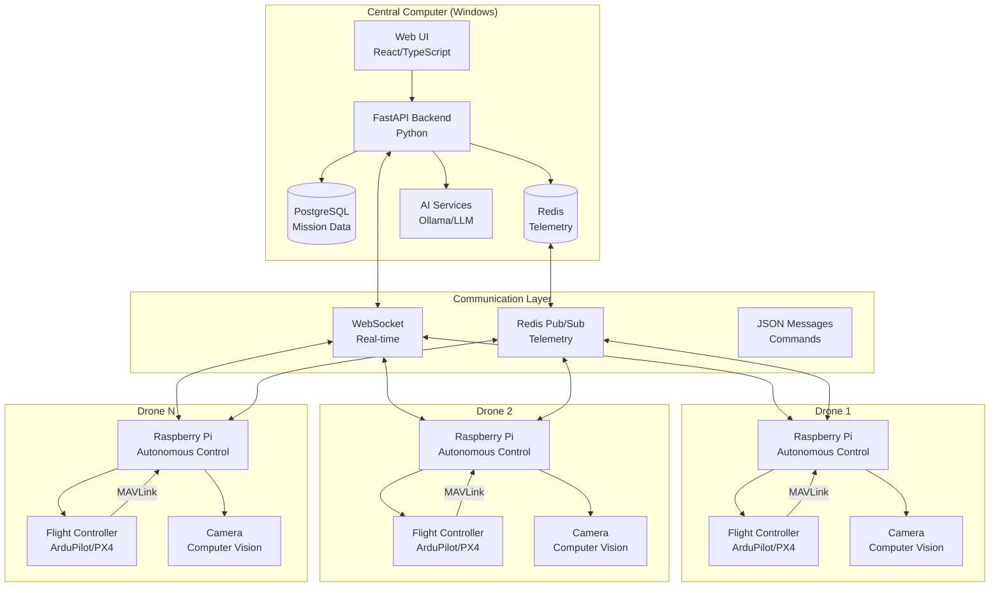
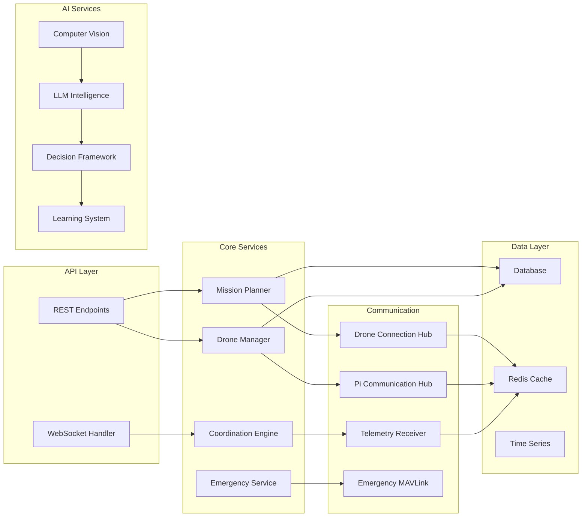
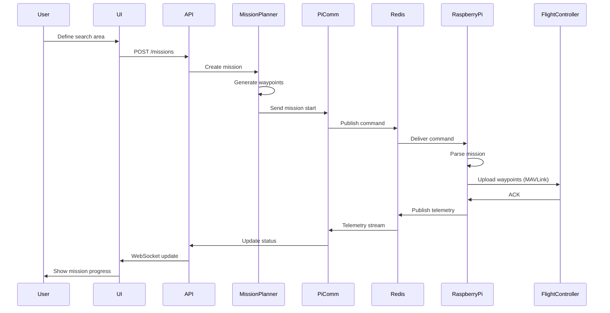
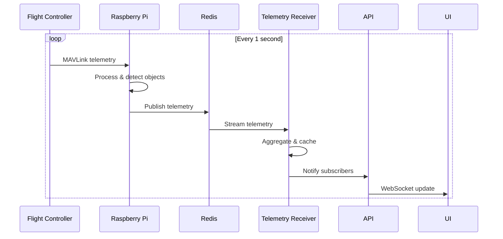
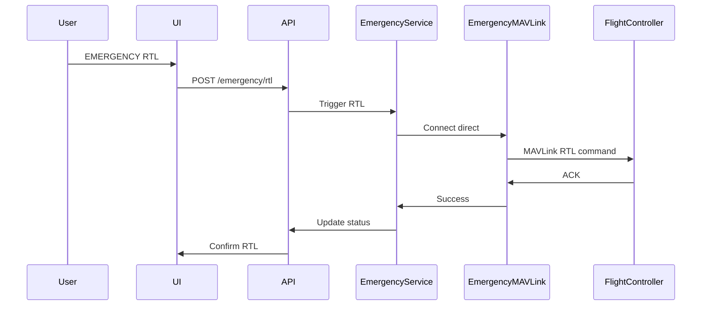

# SAR Drone Swarm System - Architecture

## System Overview

The SAR (Search and Rescue) Drone Swarm System is a distributed architecture designed for coordinating multiple autonomous drones in search and rescue operations. The system uses a central computer for mission planning and monitoring, with Raspberry Pi units on each drone handling autonomous execution.

## High-Level Architecture



## Component Architecture

### Backend Services



## Communication Flow

### Mission Start Sequence



### Telemetry Flow



### Emergency Override



## Data Models

### Mission

```python
class Mission:
    id: UUID
    name: str
    status: MissionStatus  # planned, active, paused, completed
    search_area: Polygon
    waypoints: List[Waypoint]
    assigned_drones: List[UUID]
    created_at: datetime
    started_at: Optional[datetime]
    completed_at: Optional[datetime]
```

### Drone

```python
class Drone:
    id: UUID
    name: str
    status: DroneStatus  # offline, idle, active, emergency
    position: Position  # lat, lon, alt
    battery: float  # 0.0 - 1.0
    signal_strength: float
    current_mission_id: Optional[UUID]
    connection_type: ConnectionType  # wifi, lora, mavlink, websocket
```

### Telemetry

```python
class AggregatedTelemetry:
    drone_id: str
    timestamp: datetime
    source: TelemetrySource
    position: Dict[str, float]  # lat, lon, alt
    heading: float
    ground_speed: float
    battery_voltage: float
    battery_remaining: float
    signal_strength: float
    mission_status: str
    recent_detections: List[Dict]
```

## Technology Stack

### Central Computer (Backend)
- **Framework**: FastAPI (Python 3.10+)
- **Database**: PostgreSQL (primary), SQLite (fallback)
- **Cache**: Redis (telemetry, pub/sub)
- **AI**: Ollama (local LLM), YOLOv8 (object detection)
- **WebSocket**: FastAPI WebSocket
- **Testing**: pytest, pytest-asyncio

### Central Computer (Frontend)
- **Framework**: React 18 + TypeScript
- **UI**: TailwindCSS, Headless UI
- **Maps**: Leaflet.js
- **Charts**: Recharts
- **State**: React Context + Hooks
- **Build**: Vite

### Raspberry Pi
- **OS**: Raspberry Pi OS (Debian-based)
- **Runtime**: Python 3.10+
- **Flight Control**: pymavlink (MAVLink protocol)
- **Vision**: OpenCV, YOLOv8 (TensorFlow Lite)
- **Communication**: Redis client, WebSocket client

## Deployment

### Development
```bash
# Backend
cd backend
python -m venv .venv
source .venv/bin/activate  # Windows: .venv\Scripts\activate
pip install -r requirements.txt
uvicorn app.main:app --reload

# Frontend
cd frontend
npm install
npm run dev
```

### Production
```bash
# Docker Compose
docker-compose -f docker-compose.production.yml up -d

# Kubernetes
kubectl apply -f deployment/kubernetes/
```

## Security Considerations

1. **Authentication**: JWT-based authentication for API access
2. **Authorization**: Role-based access control (RBAC)
3. **Encryption**: TLS/SSL for all communications
4. **API Keys**: Required for external integrations
5. **Rate Limiting**: Prevent abuse of API endpoints
6. **Input Validation**: Strict validation using Pydantic models
7. **Emergency Override**: Direct MAVLink access with authentication

## Scalability

- **Horizontal Scaling**: Multiple backend instances behind load balancer
- **Redis Cluster**: For high telemetry throughput
- **Database Replication**: PostgreSQL read replicas
- **CDN**: Static frontend assets
- **Message Queue**: For async task processing

## Monitoring & Observability

- **Metrics**: Prometheus + Grafana
- **Logging**: Structured logging with structlog
- **Tracing**: OpenTelemetry integration
- **Alerting**: Custom alerting rules for emergencies
- **Health Checks**: Kubernetes liveness/readiness probes

## Recovery Procedures

### System Failure
1. Emergency MAVLink connection activates
2. All drones commanded to Return to Launch (RTL)
3. System attempts auto-recovery
4. Manual override available

### Drone Loss
1. Last known position logged
2. Other drones notified
3. Search pattern adjusted
4. Emergency protocols activated

### Communication Loss
1. Drone switches to autonomous mode
2. Executes pre-programmed mission
3. Returns to launch on timeout
4. Reconnection attempts continue

---

**Version**: 1.0.0  
**Last Updated**: 2025-10-11  
**Status**: Phase 1 Recovery Complete

